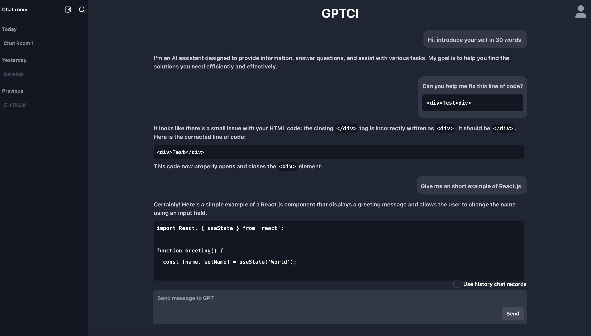

# API based GPT chat interface
The OpenAI has provided an api for people needed to use the GPT by code/command. This allowed us to use GPT with a "pay as you go" method. This project is made to build a chatting interface with GPT using the api key that can be obtained from the OpenAI official webpage, so we don't have to pay $20 each month. The application looks like below:



To setup the project, you need to first clone the project then follow the steps below. Also, make sure that you have a certified server with proper protection, or just modified the api code to let it match the plain HTTP method.


### Create database
##### Create a config file
-   Create a script called *apib_gptci-db-config.sql* in `db` folder, put the line in it: 
    ```
    SET @db_password = 'YOUR_PASSWORD_HERE';
    ```
##### Create table and user
-   Source the script *apib_gptci-db-config.sql* and *create-table.sql* with MySQL root identity to create the table and user.
There should be two users that has been created, the first one is `APIB_GPTCI_root` which can only be connected within localhost, and another being `APIB_GPTCI_admin` that can be connected from anywhere.

### Setup API config files
##### Create a config file
-   Create a config file `config.py` in `/api` folder, put in the lines:
    ```
    ssh_username = 'YOUR_SSH_USERNAME_HERE'
    ssh_password = 'YOUR_SSH_PASSWORD_HERE'
    db_password = 'YOUR_DB_PASSWORD_HERE'
    data_storage_path = "PLACE_YOU_WANT_TO_STORE_USER_DATAS_HERE"
    ```
    The ssh connection is used for `app` to connect `api`. Data storage path is used store user chat datas and keys(after encryption).

##### Create another config file
-   Create a config file `config.py` in `/api/Authentication` folder, put in the lines:
    ```
    ACCESS_TOKEN_SECRET_KEY = 'YOUR_SECRET_KEY_HERE'
    ALGORITHM = 'HS256'
    ```
    `YOUR_SECRET_KEY_HERE` can be generated by using `openssl` command.

### Build the application
You can choose to build the application by Jenkins pipeline script or just use the commands in it. The Jenkins pipeline script `Build - API & APP` stage is used to run the Docker related commands, so just follow the commands in it.

> **_NOTE:_**
> The original project is deployed on NAS server, witch means the code needs to match your server settings. The api and app route should all be certified, and remember to change the `allow_origins` in `/api/main.py` to let your frontend communicate with api properly.

> **_NOTE:_**
> There's another setup README in `/db` folder, that's the old method of my deployment, but it should also work. Just make sure the database password consistency with api.